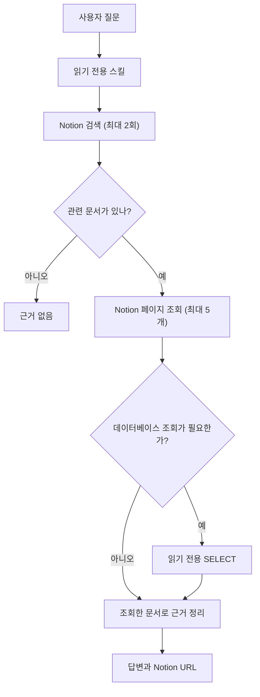

# GDGoC Notion Local Test Skill

## Codex CLI

Notion MCP 연결을 확인합니다.

```sh
codex mcp get notion
```

연결이 없거나 인증이 필요하면 설정합니다.

```sh
codex mcp add notion --url https://mcp.notion.com/mcp
codex mcp login notion
```

저장소 루트에서 스킬을 연결한 뒤 Codex를 시작합니다.

```sh
SKILL_DIR="$PWD/skills/gdgoc-knowledge-local-test"
CODEX_SKILLS_DIR="${CODEX_HOME:-$HOME/.codex}/skills"

mkdir -p "$CODEX_SKILLS_DIR"
ln -s "$SKILL_DIR" "$CODEX_SKILLS_DIR/gdgoc-knowledge-local-test"
codex
```

Codex 입력창에서 실행합니다.

```text
$gdgoc-knowledge-local-test 사업단과의 협업 방식을 실제 Notion 문서로 확인해줘
```

## Claude Code

저장소 루트에서 Notion MCP 연결을 확인합니다.

```sh
claude mcp get notion
```

연결이 없으면 추가하고, `Needs authentication`이면 로그인합니다.

```sh
claude mcp add --transport http notion https://mcp.notion.com/mcp
claude mcp login notion
```

저장소 루트에서 Claude Code를 시작한 뒤 입력창에서 실행합니다.

```sh
claude
```

```text
/gdgoc-knowledge-local-test 사업단과의 협업 방식을 실제 Notion 문서로 확인해줘
```

## 추론 흐름


